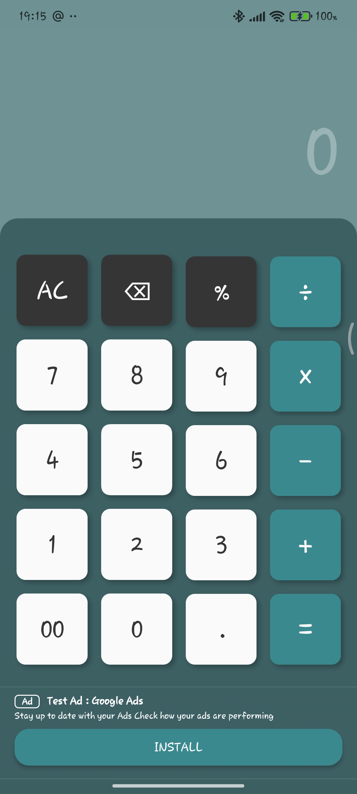
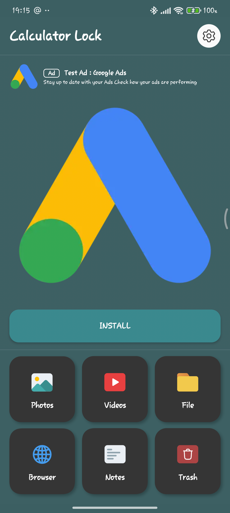
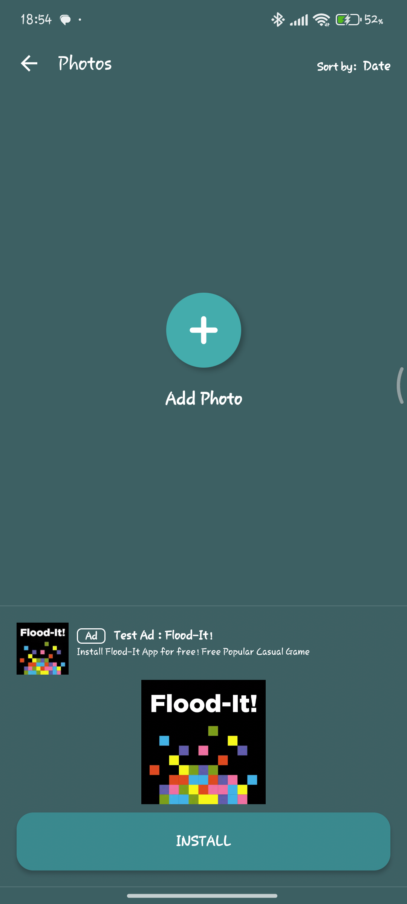
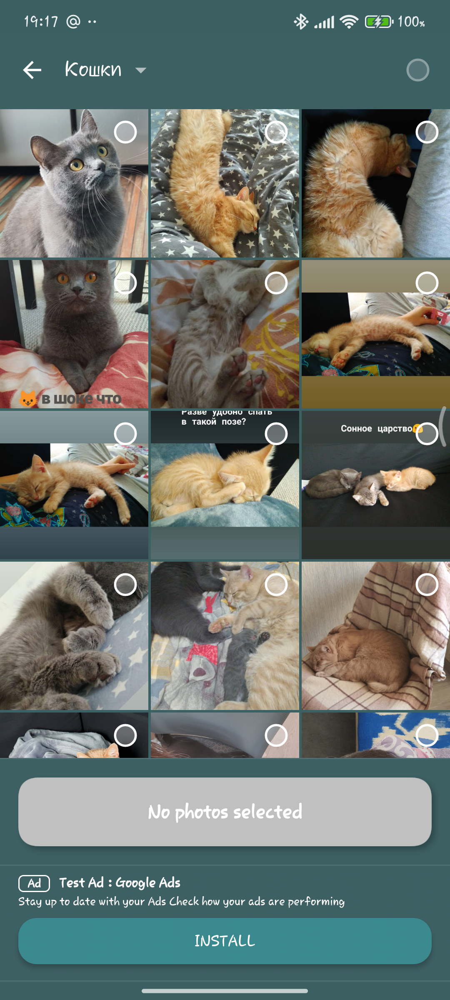
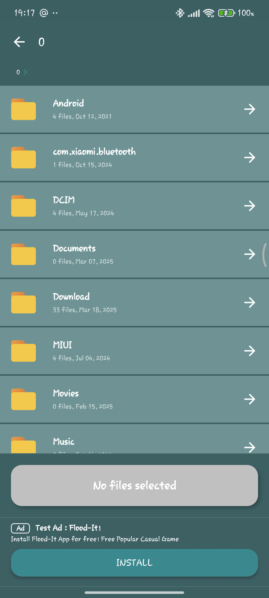
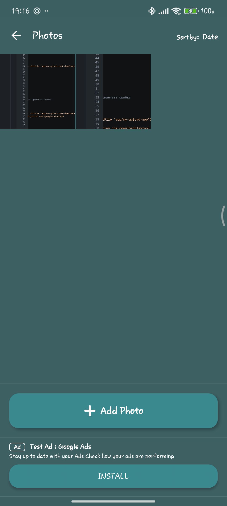
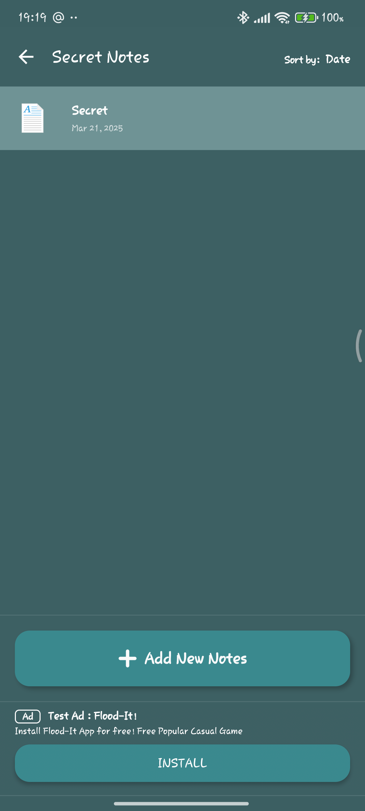
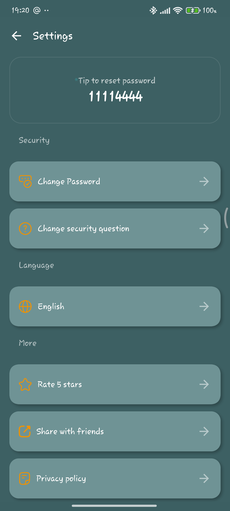
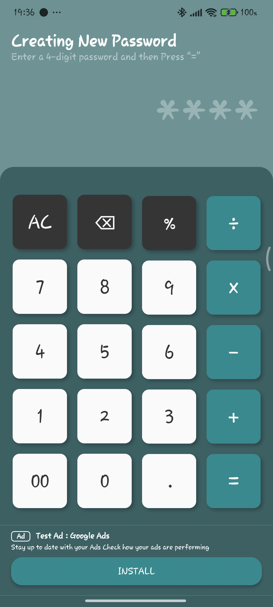
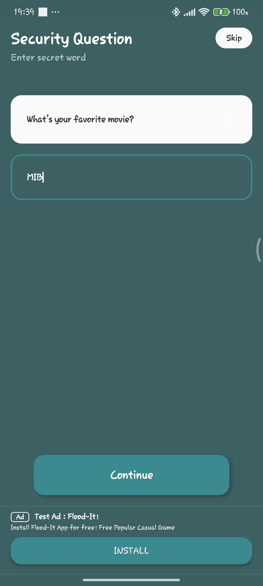

# Calculator - File Blocking

This is a project that provides users with the ability to hide their files behind the calculator
functionality.

# Technology stack

* Kotlin Multiplatform
* Jetpack Compose Multiplatform
* Decompose
* MVI
* Koin
* Room
* Data store
* Coroutines
* Firebase (Analytics, Crashlytics, RemoteConfig)

# Screenshot

### Calculator

<!--suppress CheckImageSize -->

### Home

### Features

  
  

### Notes

### Browser

### Settings

### Change Password

### Change security question

### Languages

